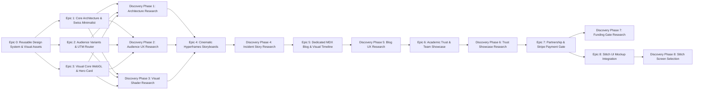

# Swiss Medical Minimalist Landing Page — Architecture & Dependency Graph (`/graphify`)

> **Generated for:** `/plan-ceo-review` & 9-Epic Framework  
> **Target System:** High-Trust Dialysis Platform Visual Landing Page & Digital Hub  
> **Strategic Mode:** SELECTIVE EXPANSION  
> **Architecture Rules:**  
> 1. **EPIC 0 Foundation**: Reusable GSAP text animation utilities, WebGL shader vignettes, Hyperframes video engine, and screen-wide parallax card wrappers.  
> 2. **Discovery Phase per Epic**: Internet grounding research + interactive user interviews (`ask_question`) before implementation.  
> 3. **Screen-Wide Parallax Cards**: Every priority and section is a 100vw x 100vh parallax card with giant typography.  
> 4. **EPIC 8 Integration**: Dedicated Epic for integrating Stitch project `503366360860058565` UI mockups.

---

## 1. System Topology & Component Flow

```mermaid
graph TD
    subgraph EPIC 0: Reusable Component & Visual Asset Foundation
        GSAPUtil[GSAP SplitText & Morph Animation Utilities]
        ShaderUtil[Full-Bleed WebGL Fluid Shader Module]
        ThreeJSUtil[Three.js CAD Wireframe Cylinder Module]
        HyperframeUtil[Hyperframes Scroll-Driven Video Scrubber]
        ParallaxShell[Screen-Wide Parallax Card Shell 100vw x 100vh]
    end

    subgraph Client Layer
        Browser[User Browser / Mobile Device]
        Router[UTM Parameter Parser & Persona Router]
    end

    subgraph Landing Page Shell
        Nav[Header & Minimalist Sticky Persona Switcher]
        VariantEngine{Role Variant State Router}
    end

    subgraph Screen-Wide Parallax Cards
        Card0[Card 00: Hero & WebGL Dialysate Clearance Canvas]
        Card1[Card 01: Priority 4.1 - Eliminate Paper Blindspot]
        Card2[Card 02: Priority 4.2 - Point-of-Care Dashboards]
        Card3[Card 03: Priority 4.3 - Longitudinal Risk Profile]
        Card4[Card 04: Priority 4.4 - MedGemma AI Interception]
        Card5[Card 05: Clinical Outbreak Evidence London & Seoul]
        Card6[Card 06: Visual Milestone Progress Timeline]
        Card7[Card 07: Pharos Univ Dean & Team Showcase]
        Card8[Card 08: Sponsorship Matrix & Stripe Payment Gate]
    end

    subgraph EPIC 8: Stitch UI Mockup Integration
        StitchMockups[Stitch Project 503366360860058565 - 16 Clinical Screens]
        EnclosureComponent[Interactive HTML/CSS Mockup Enclosures]
    end

    subgraph Dedicated Sub-Page Routing
        BlogRoute[/blog - Dedicated Field Survey MDX Index]
        BlogPost[/blog/dialysis-field-survey-incidents - Clean MDX Article]
    end

    GSAPUtil & ShaderUtil & ThreeJSUtil & HyperframeUtil & ParallaxShell --> Card0 & Card1 & Card2 & Card3 & Card4 & Card5 & Card6 & Card7 & Card8

    StitchMockups --> EnclosureComponent
    EnclosureComponent --> Card1 & Card2 & Card4

    Browser --> Router
    Router --> Nav
    Nav --> VariantEngine
    Nav -->|Click Blog Link| BlogRoute
    BlogRoute --> BlogPost

    VariantEngine -->|?utm_role=patient| Card0
    VariantEngine -->|?utm_role=nurse| Card0
    VariantEngine -->|?utm_role=clinician| Card0

    Card0 --> Card1 --> Card2 --> Card3 --> Card4 --> Card5 --> Card6 --> Card7 --> Card8
```

---

## 2. Epic & Feature Dependency Tree



---

## 3. Epic Development Sequence

| Epic | Priority | Blocked By | Mandated Discovery Phase |
| :--- | :--- | :--- | :--- |
| **Epic 0** | P0 (Foundation) | None | Core Asset Building (GSAP, WebGL, Parallax Shell) |
| **Epic 1** | P0 (Critical) | Epic 0 | Task 1.1.1: Astro Setup & Architecture Interview |
| **Epic 2** | P0 (Critical) | Epic 0, Epic 1 | Task 2.1.1: Persona Routing & UTM Research Interview |
| **Epic 3** | P1 (High) | Epic 0, Epic 1 | Task 3.1.1: WebGL Dialysate Shader Interview |
| **Epic 4** | P1 (High) | Epic 0, Epic 2, Epic 3 | Task 4.1.1: Outbreak Storyboard Video Interview |
| **Epic 5** | P2 (Medium) | Epic 0, Epic 1 | Task 5.1.1: MDX Blog Layout & Roadmap Interview |
| **Epic 6** | P2 (Medium) | Epic 0, Epic 5 | Task 6.1.1: Academic Trust & Student Metric Interview |
| **Epic 7** | P3 (Normal) | Epic 0, Epic 6 | Task 7.1.1: Stripe Sponsorship UX Interview |
| **Epic 8** | P3 (Normal) | Epic 0, Epic 7 | Task 8.1.1: Stitch Screen Selection & Integration Interview |
