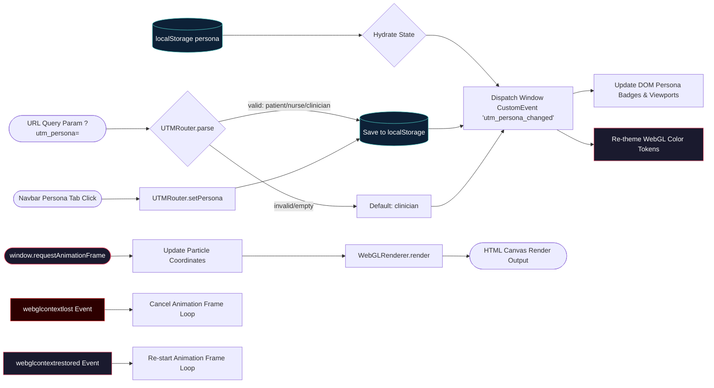

# Data Flow & State Mutation Diagram

> Generated by Graphify on 2026-08-11. Data transformations, query parameter routing, and WebGL telemetry streams.

## Diagram

## Analysis Notes

- **Persona Routing Stream:** Client-side URL parameters and header clicks write to `localStorage` and trigger window events for reactive DOM and theme updates without full page reloads.
- **WebGL Frame Loop:** Non-blocking async rendering loop bound to container resize and WebGL context restoration events (`webglcontextlost`, `webglcontextrestored`).
- **Storage Safety:** `UTMRouter` checks `typeof window !== 'undefined'` to safely operate under Astro SSR compilation.
