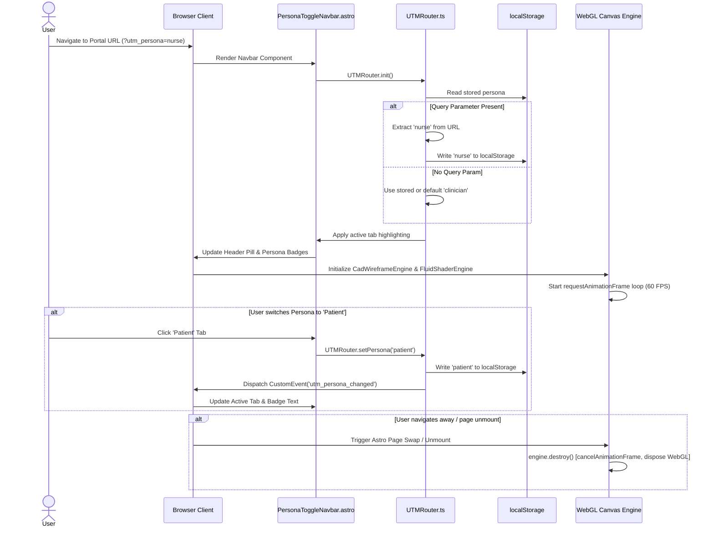

# Sequence / Flow Diagram

> Generated by Graphify on 2026-08-11. Page Initialization, Persona Routing, and WebGL Lifecycle Sequence.

## Diagram

## Analysis Notes

- **Initial Load Sequence:** Seamlessly resolves priority between URL parameters (`?utm_persona=`), `localStorage`, and default fallbacks.
- **Dynamic Event Bus:** UI components react to window custom events without requiring full page refreshes.
- **Clean Unmount Sequence:** WebGL animation frame loops and buffers are freed prior to route transitions.
