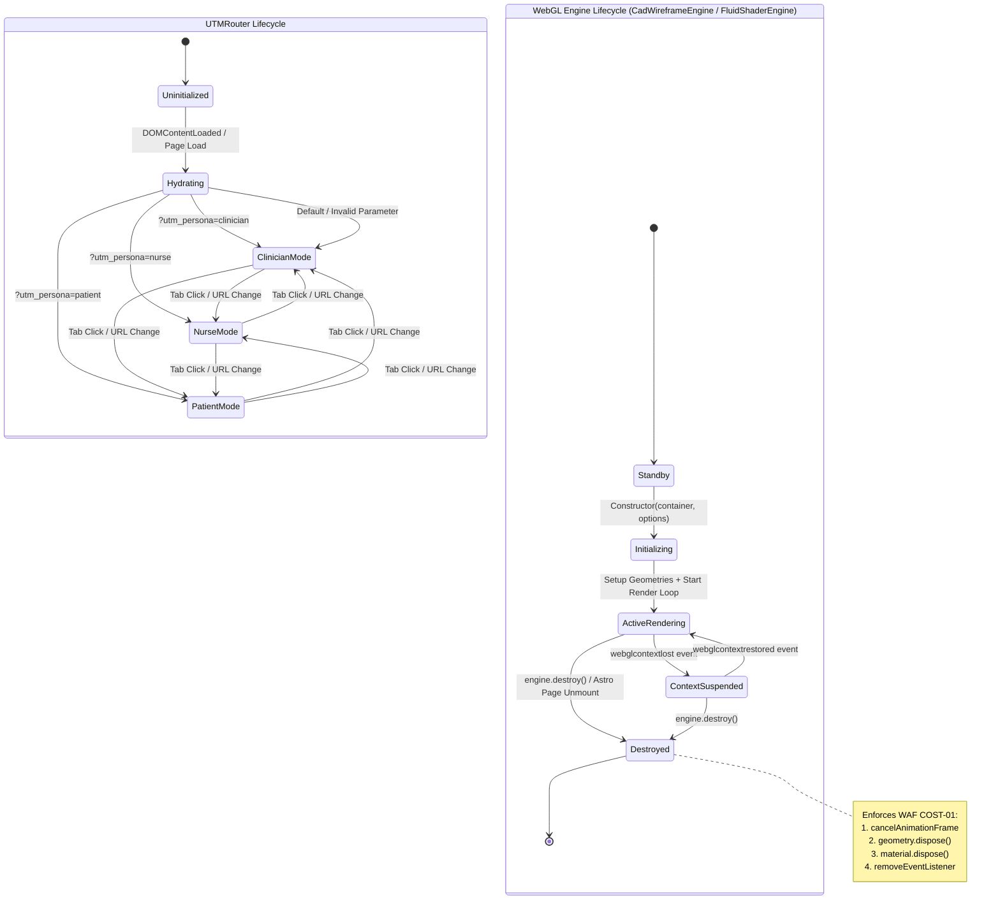

# State Machine Diagram

> Generated by Graphify on 2026-08-11. State transitions for UTMRouter and WebGL Engine Lifecycles.

## Diagram

## Analysis Notes

- **Persona Routing Finite Automaton:** Guarantees deterministic state between `clinician`, `nurse`, and `patient` modes.
- **Resource Teardown Automaton:** Complies with WAF `COST-01` memory safety. On page transition or engine unmount, all WebGL buffers, geometries, materials, and RAF timers are explicitly disposed.
