# System Topology (C4 Architecture)

> Generated by Graphify on 2026-08-11. Architectural Topology of the Pharos Hemodialysis Portal.

## Diagram

```mermaid
graph TD
  subgraph "Client Browser / Device"
    UI[Astro SSR / CSR Multi-Persona Pages]
    UTM_STATE[UTMRouter Persona State Manager]
  end

  subgraph "Astro Subfolder Monorepo (dashboard/)"
    ROUTER[PersonaToggleNavbar & Layout Router]

    subgraph "Visual & Shader Engine Layer"
      CAD[CadWireframeEngine.ts - WebGL 3D Cylinder]
      FLUID[FluidShaderEngine.ts - Dialysate Raymarch Shader]
    end

    subgraph "GSAP Animation Engine Layer"
      SCRUB[HyperframesScrubber.ts - Canvas Video Scrub]
      PARALLAX[ParallaxCardScrollTrigger.ts - Card Parallax]
      SPLIT[TextSplitUtil.ts - Editorial Typography Anims]
    end

    subgraph "Design System & UI Primitives"
      TOKENS[clinicalVitalityTokens.ts]
      CSS[global.css Master Design Tokens]
      SWISS[SwissCardPrimitive.astro / .tsx]
      LOADER[ClinicalResonanceLoader.astro]
    end

    subgraph "Page Views (src/pages/)"
      P_INDEX[index.astro - Main Portal]
      P_ARCH[architecture.astro - System Specs]
      P_ABOUT[about.astro - Clinical Mission]
      P_EVID[evidence.astro - Clinical Trial Data]
      P_JOUR[journal.astro - Research Blog]
      P_PART[partner.astro - Institutional Outreach]
    end
  end

  subgraph "External Integrations & Services"
    EXT_MEDGEMMA[MedGemma AI Clinical CPOE Rules]
    EXT_VERCEL[Vercel Edge Deployment Platform]
    EXT_STITCH[Stitch Clinical Vitality Tokens #503366360860058565]
  end

  UI --> ROUTER
  ROUTER --> UTM_STATE
  UTM_STATE --> TOKENS
  ROUTER --> P_INDEX
  ROUTER --> P_ARCH
  ROUTER --> P_ABOUT
  ROUTER --> P_EVID
  ROUTER --> P_JOUR
  ROUTER --> P_PART

  P_INDEX --> CAD
  P_INDEX --> FLUID
  P_INDEX --> SCRUB
  P_INDEX --> PARALLAX
  P_INDEX --> SPLIT

  P_ARCH --> SWISS
  P_ABOUT --> SWISS
  P_EVID --> SWISS
  P_JOUR --> SWISS
  P_PART --> SWISS

  CAD --> LOADER
  FLUID --> LOADER

  TOKENS --> CSS
  ROUTER --> EXT_VERCEL
  P_INDEX --> EXT_MEDGEMMA
  TOKENS --> EXT_STITCH
```

## Analysis Notes

- **Primary Entry Points:** All web requests hit `dashboard/src/pages/` via Next/Astro proxy scripts in root `package.json`.
- **Subsystem Boundaries:**
  1. `lib/canvas/`: WebGL 3D CAD wireframe engine and fluid shader raymarching.
  2. `lib/gsap/`: Frame-scrubbing, scroll triggers, and typography animation.
  3. `lib/routing/` & `lib/tokens/`: UTM query parsing, local storage state persistence, design system tokens.
  4. `pages/`: 6 responsive editorial landing page routes.
- **External Dependencies:** Three.js, GSAP ScrollTrigger, Tailwind CSS v4, Vercel Edge hosting.
